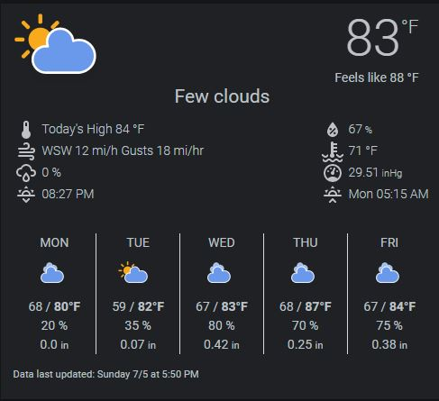

# Weatherbit Weather Card



This card is a modification of iammexx/home-assistant-config dark-sky-weather-card.  It adds the dewpoint to the optional slot entities, uses the correct UOM for barometric pressure, and adds the forecasted amount of precipitation to the forecast section if enabled.  There are also some minor stylistic changes.

The Weatherbit Weather Card provides current and forecasted weather conditions using the Weatherbit platform.  You configure the card by passing in sensor entities from the Weatherbit platform.  Some sensors required for the card must be created using template sensors.

The card is very customizable.  You can configure many aspects of its look and feel as well as which specific content to show by passing in customization flags and defining optional sensors.  Content can also be rearranged if desired.  Hovering over a forecast day will display the daily forecast text string in a tooltip popup if that option has been enabled.


**Manual Installation**
------------------------------
1. Add ```weatherbit-weather-card.js``` to your ```<config-dir>/www/lovelace/``` directory.  If you don't have this directory (this is your first custom card), you will need to create it.

2. Download the amcharts icons from https://www.amcharts.com/dl/svg-weather-icons/ and put them in ```<config-dir>/www/icons/weather_icons```.  Create the directories if necessary.

   You should end up with the following folders:

   ```<config-dir>/www/lovelace/weatherbit-weather-card.js```

   ```<config-dir>/www/icons/weather_icons/animated/```

   ```<config-dir>/www/icons/weather_icons/static/```

**Configuration**
------------------------------
1. Add the Weatherbit integration via the Configuration->Integrations panel of Home Assistant. See https://github.com/briis/weatherbit for more information.

    The next two steps are completed differently based on the version of HA you are using:

    If you are using yaml mode:
    - Pre 0.84 or if using yaml mode in 0.84 -0.107: Add to your ui-lovelace.yaml file.
    - 0.107 and above: Add the resources section to the lovelace: section of your configuration.yaml file, and the card definition to your ui-lovelace.yaml file.

    If you are using storage mode in 0.84 or above:
    - Use the "Raw Config Editor" to add the reference and definition to the config.

2. Add the card reference at the top of the configuration:

   **Note: Ensure type is set to module and not js.**<br>
   **Note: /local/ points to the ```<config-dir>/www/``` dir.**

    ~~~~
    resources:
      - url: /local/lovelace/weatherbit-weather-card.js
        type: module
    ~~~~

3. Add the card definition:  There are required, optional and flag entries.

    **Required entries** must be present in your configuration.  The card will not work at all if any of these lines are missing.

    The sensors for current conditions, forecast high temperatures, forecast low temperatures, and entity summaries are created with template sensors (see below).  (All sensors that start with ```wbit_``` are template sensors, to help distinguish them from sensors directly provided by the integration.)

    ~~~~
    type: 'custom:weatherbit-weather-card'
    entity_current_conditions: sensor.wbit_icon_condition
    entity_current_text: sensor.weatherbit_description
    entity_temperature: sensor.weatherbit_temperature
    entity_apparent_temp: sensor.weatherbit_apparent_temperature
    entity_forecast_icon_1: sensor.weatherbit_forecast_day_2
    entity_forecast_icon_2: sensor.weatherbit_forecast_day_3
    entity_forecast_icon_3: sensor.weatherbit_forecast_day_4
    entity_forecast_icon_4: sensor.weatherbit_forecast_day_5
    entity_forecast_icon_5: sensor.weatherbit_forecast_day_6
    entity_forecast_high_temp_1: sensor.wbit_day2_high
    entity_forecast_high_temp_2: sensor.wbit_day3_high
    entity_forecast_high_temp_3: sensor.wbit_day4_high
    entity_forecast_high_temp_4: sensor.wbit_day5_high
    entity_forecast_high_temp_5: sensor.wbit_day6_high
    entity_forecast_low_temp_1: sensor.wbit_day2_low
    entity_forecast_low_temp_2: sensor.wbit_day3_low
    entity_forecast_low_temp_3: sensor.wbit_day4_low
    entity_forecast_low_temp_4: sensor.wbit_day5_low
    entity_forecast_low_temp_5: sensor.wbit_day6_low
    entity_summary_1: sensor.wbit_day2_text
    entity_summary_2: sensor.wbit_day3_text
    entity_summary_3: sensor.wbit_day4_text
    entity_summary_4: sensor.wbit_day5_text
    entity_summary_5: sensor.wbit_day6_text
    ~~~~

    **Optional entries** add components to the card.  Including the sun sensor will provide the next sunrise and sunset times. The daytime high and all pop and precip entities require template sensors (see below).<br>
    **Note:** entity_pop_1 to 5 lines must all be included for daily pop (probability of precip) to show in forecast.<br>
    **Note:** entity_pos_1 to 5 lines must all be included for daily precip (forecast amount of precipitation) to show in forecast.

    ~~~~
    entity_sun: sun.sun
    entity_daytime_high: sensor.wbit_day1_high
    entity_humidity: sensor.weatherbit_humidity
    entity_pop: sensor.wbit_day1_pop
    entity_pressure: sensor.weatherbit_pressure
    entity_visibility: sensor.weatherbit_visibility
    entity_wind_bearing: sensor.weatherbit_wind_bearing
    entity_wind_speed: sensor.weatherbit_wind_speed
    entity_dewpoint: sensor.weatherbit_dewpoint
    entity_pop_1: sensor.wbit_day2_pop
    entity_pop_2: sensor.wbit_day3_pop
    entity_pop_3: sensor.wbit_day4_pop
    entity_pop_4: sensor.wbit_day5_pop
    entity_pop_5: sensor.wbit_day6_pop
    entity_pos_1: sensor.wbit_day2_precip
    entity_pos_2: sensor.wbit_day3_precip
    entity_pos_3: sensor.wbit_day4_precip
    entity_pos_4: sensor.wbit_day5_precip
    entity_pos_5: sensor.wbit_day6_precip
    ~~~~

    **Note:** The following optional entries require template sensors.  The alt_* entries are for overriding the text for the indicated slot entry. By using these you can create whatever format you like for these entries.
    ~~~~
    alt_daytime_high: sensor.wbit_alt_daytime_high
    alt_wind: sensor.wbit_alt_wind
    alt_visibility: sensor.wbit_alt_visibility
    alt_pop: sensor.wbit_alt_pop
    alt_pressure: sensor.wbit_alt_pressure
    alt_humidity: sensor.wbit_alt_humidity
    ~~~~

    **Example template sensors:** You can call template sensors whatever you want so long as you use the same name in the card config.

    ~~~~~
    wbit_icon_condition:
      value_template: "{{ state_attr('weather.weatherbit_xxx', 'alt_condition') }}"
    ~~~~~

    **Note:** Your weatherbit.weather entity will have a name specific to your location.

    ~~~~~
    wbit_day1_high:
      value_template: "{{ state_attr('sensor.weatherbit_forecast_day_1', 'temperature') }}"
      unit_of_measurement: '°F'
    ~~~~~
    ~~~~~
    wbit_day1_low:
      value_template: "{{ state_attr('sensor.weatherbit_forecast_day_1', 'templow') }}"
      unit_of_measurement: '°F'
    ~~~~~
    ~~~~~
    wbit_day1_pop:
      value_template: "{{ state_attr('sensor.weatherbit_forecast_day_1', 'precip_prob') }}"
      unit_of_measurement: '%'
    ~~~~~
    ~~~~~
    wbit_day1_precip:
      value_template: "{{ state_attr('sensor.weatherbit_forecast_day_1', 'precipitation') }}"
      unit_of_measurement: 'in'
    ~~~~~
    ~~~~~
    wbit_day1_text:
      value_template: "{{ state_attr('sensor.weatherbit_forecast_day_1', 'weather_text') }}"
    ~~~~~
    **Note:**  If you do not wish to use the tooltip popup feature, you do not need to define these five template sensors.  Simply replace them in the card config with ```sensor.weatherbit_description``` for all five ```entity_summary_*n*:``` entries.  It doesn't matter what they contain, as they will not show without the tooltip feature enabled.
    ~~~~~
    wbit_alt_wind:
      value_template: >-
                      
                      {{ states('sensor.dark_sky_wind_speed') | round }} mi/h from the {{ winddir[((states('sensor.dark_sky_wind_bearing') | float / 360)*16) | round]}}
    ~~~~~

    Flags are used to control the look and feel of the card (See below for details).  The card shown above uses the following flag settings:

    ~~~~
    locale: en
    static_icons: true
    tooltip_bg_color: 'rgb( 75,155,239)'
    tooltip_border_color: orange
    tooltip_border_width: 3
    tooltip_caret_size: 10
    tooltip_fg_color: '#fff'
    tooltip_left_offset: -12
    tooltip_width: 100
    tooltips: true
    old_daily_format: false
    time_format: 12
    show_beaufort: false
    show_separator: false
    slot_l3: pop
    slot_r1: humidity
    slot_r2: dewpoint
    slot_r3: pressure
    current_text_top_margin: 65px
    ~~~~

    **Flags**
    --------------------------
    | Flag                     | Values                      | Usage                                                                       |
    |--------------------------|-----------------------------|-----------------------------------------------------------------------------|
    | locale                   | **en** / fr / de / etc.     | Sets locale display of day names and time formats                           |
    | static_icons             | true / **false**            | Switches between static (true) and animated (false) icons                   |
    | tooltips                 | true / **false**            | Enables tooltips that show daily forecast summary                           |
    | tooltip_width            | **110**                     | Sets the width of the tooltip in px                                         |
    | tooltip_bg_color         | **rgb( 75,155,239)**        | Sets the background color of the tooltip (rgb / # / color)                  |
    | tooltip_fg_color         | **#fff**                    | Sets the foreground color of the tooltip (rgb / # / color)                  |
    | tooltip_border_color     | **rgb(255,161,0)**          | Sets the color of the tooltip border including the caret (rgb / # / color)  |
    | tooltip_border_width     | **1**                       | Sets the width of the tooltip border in px                                  |
    | tooltip_caret_size       | **5**                       | Sets the size of the caret (the little arrow pointing down) in px           |
    | tooltip_left_offset      | **-12**                     | Sets the offset of the left edge of the tooltip. In negative (-)x           |
    | refresh_interval         | **30** / Integer value      | Sets the nuber of seconds between card value refreshes                      |
    | old_daily_format         | true / **false**            | Sets the format of the daily high & low temps to be stacked (old format)    |
    | show_beaufort            | true / **false**            | Shows Beaufort Scale wind information                                       |
    | show_separator           | true / **false**            | Shows separator between current conditions columns and current temp / Icon  |
    | time_format              | **locale** / 12 / 24        | Sets the format sunset and sunrise times. locale format is the default.     |
    | temp_top_margin          | **0em** / px or em value  | Sets the top margin of the Temperature.                                     |
    | temp_font_weight         | **300** / numeric value     | Sets the font weight of the Temperature.                                    |
    | temp_font_size           | **4em** / em value          | Sets the font size of the Temperature.                                      |
    | temp_right_pos           | **.85em** / px or em value  | Sets the right position of the Temperature.                                 |
    | temp_uom_top_margin      | **-12px** / px or em value   | Sets the top margin of the Temperature Unit of Meaure.                      |
    | temp_uom_right_margin    | **7px** / px or em value    | Sets the right margin of the Temperature Unit of Measure.                   |
    | apparent_top_margin      | **39px** / px or em value   | Sets the top margin of the apparent (feels Like) temperature                |
    | apparent_right_pos       | **1em** / px or em value    | Sets the right position of the apparent (feels Like) temperature            |
    | apparent_right_margin    | **1em** / px or em value    | Sets the right margin of the apparent (feels Like) temperature              |
    | current_text_top_margin  | **39px** / px or em value   | Sets the top margin of the current temperature text                         |
    | current_text_left_pos    | **0em** / px or em value    | Sets the left position of the current temperature text                      |
    | current_text_font_size   | **1.5em** / em value        | Sets the font size of the current temperature text                          |
    | current_data_top_margin  | **6em** / px or em value    | Sets the top margin of the current data blocks                              |
    | large_icon_top_margin    | **-3.2em** / px or em value | Sets the top margin of the current conditions icon                          |
    | large_icon_left_position | **0em** / px or em value    | Sets the left position of the current conditions icon                       |
    | separator_top_margin     | **5em** / px or em value    | Sets the top margin of the separator line                                   |
    | forecast_height          | **10em**                    | Sets the height of the forecast section.                                    |
    | slot_l1                  | **daytime_high**            | Sets the value used in current conditions slot l1 : See slots for more info |
    | slot_l2                  | **wind**                    | Sets the value used in current conditions slot l2 : See slots for more info |
    | slot_l3                  | **visibility**              | Sets the value used in current conditions slot l3 : See slots for more info |
    | slot_l4                  | **sun_next**                | Sets the value used in current conditions slot l4 : See slots for more info |
    | slot_r1                  | **pop**                     | Sets the value used in current conditions slot r1 : See slots for more info |
    | slot_r2                  | **humidity**                | Sets the value used in current conditions slot r2 : See slots for more info |
    | slot_r3                  | **pressure**                | Sets the value used in current conditions slot r3 : See slots for more info |
    | slot_r4                  | **sun_following**           | Sets the value used in current conditions slot r4 : See slots for more info |


    **Slots**
    --------------------------
    The current condition columns are specified by 'slots'.  There are 4 left column slots (designated l1 - l4) and 4 right column
    slots (designated r1 - r4).  There are currently 11 possible values that can be assigned to a slot.  These are:
    - daytime_high
    - wind
    - visibility
    - sun_next (the next sun event ... sunset or sunrise)
    - sun_following (The following sun event ... if sun_next is a sunset then this will be the following sunrise and vice versa)
    - pop (probability of precipitation)
    - humidity
    - pressure
    - dewpoint
    - empty (empty slot... the slot below does not rise to fill the space)
    - remove (same as empty but the slot below rises to take the place of the slot)

[The complete Lovelace configuration for the card as shown is here.](https://github.com/Anwen747/weatherbit-weather-card/blob/master/lovelace_config.yaml)